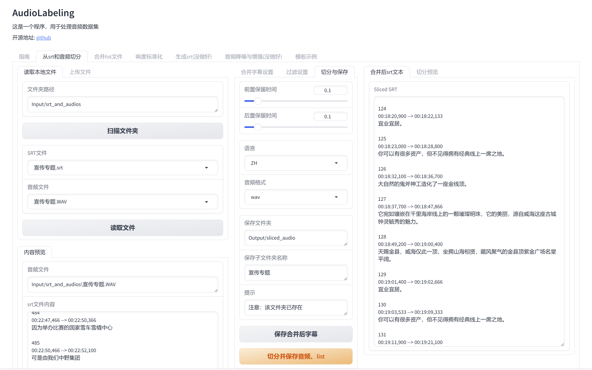
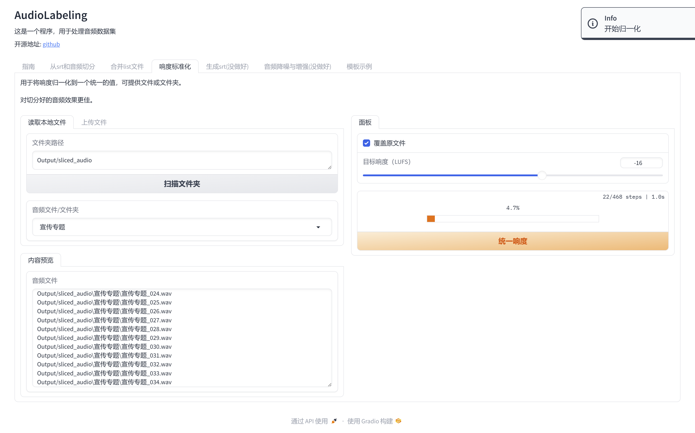
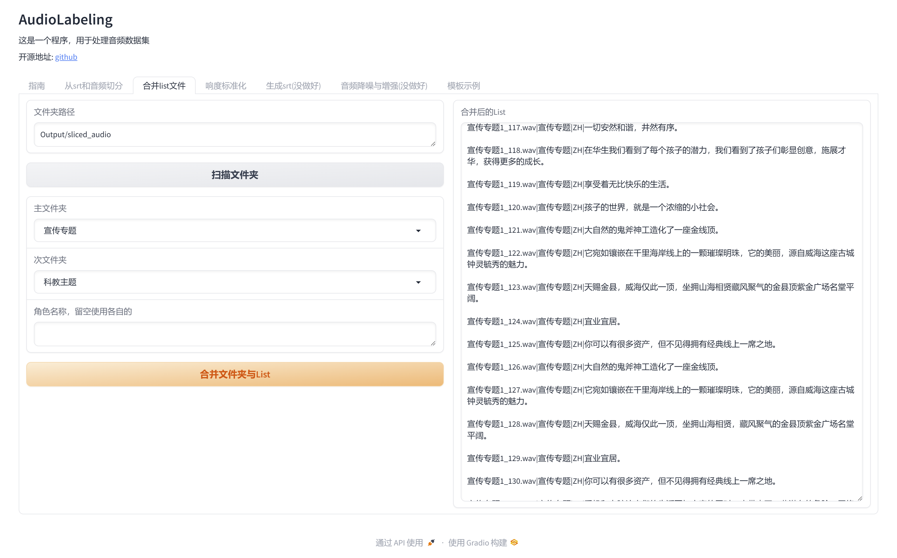

## Audio Labeling

## 使用说明
这是一个专门为人工智能领域设计的音频数据处理工具，通过 Web UI 界面，为研究人员和开发人员提供一系列高效的音频数据处理功能。它旨在帮助用户更方便地进行音频数据的标注、处理和增强，以加速机器学习项目的开发过程。

### 推荐使用方式
为了最大化工作效率，推荐在项目的数据预处理阶段使用本工具，以确保输入数据的质量和一致性。

### 建议流程

1. 前置音频处理
   1. 去人声&降噪&去混响之类
   2. （可选）AI增强并修复
   3. 生成srt文件
2. 切分并生成list文件
   1. 通过SRT文件切分音频并生成list文件
   2. 直接通过已经有打标文件的数据集生成list文件
3. 后置音频处理
   1. 响度标准化
4. 对list文件操作
   1. （可选）合并多个list文件
   2. （可选）根据特定情感/多说话人分类
   3. （可选）筛选掉不符合时长、文本要求等的数据

### 模块介绍

- **音频降噪与增强(没做好)** (`src.audio_enhancer`): 专门用于提高音频质量，包括降噪和增强音频清晰度，目前正在开发阶段。
- **生成srt** (`src.srt_generator`): 此模块旨在自动生成 SRT 字幕文件，基于funasr实现，需要torch与大约3G左右内存/显存，您当然也可以用剪映等软件。
- **从srt和音频切分** (`src.srt_slicer`): 这个模块可以从 SRT 字幕文件和对应的音频文件中自动切分出各段音频，便于后续处理。
- **合并list文件** (`src.list_merger`): 当有多个数据列表需要合并为一个统一的列表时，此模块能够简化合并过程。
- **响度标准化** (`src.audio_normalizer`): 用于将音频文件的响度标准化到一致的水平，确保数据输入的一致性。
- **情感识别** (`src.emotion_recognition`): 基于emotion2vec实现，用于把音频按9种情感分类。
- **多说话人分类(在做)** (`src.speaker_classifier`): 基于3D-Speaker实现，可以将list文件分成不同的说话人。
- **list文件筛选器(没做好)** (`src.list_filter`): 当需要从大量数据中筛选特定项时，此模块能提供帮助，目前正在开发中。
- **从已有数据集生成list(没做好)** (`src.list_generator`): 可以基于现有的数据集自动生成列表，方便管理和使用，目前仍在完善中。

特别的，我们提供了一个模板示例，可以在此基础上自定义一些模块

- **模板示例** (`src.empty_template`): 提供了一个模板示例，方便用户根据自己的需求开发新的模块。

### 截图

#### 切分并生成list文件



#### 后置音频处理



### 对list文件操作



*文档仍在书写中

## 如何安装

~~建议您使用Docker部署，也提供 ipynb 等文件用于在 colab 之类的地方使用；~~: 但是有关文件都没做好

~~但是，对于windows用户，更推荐的是直接本地用整合包启动~~：甚至整合包也没做好

您还可以选择手动安装

创建虚拟环境（建议python=3.10，要求python>3.8）-> 安装torch的cuda版本（可选） -> 安装requirements.txt

有关指令

``` 
pip install torch torchvision torchaudio --index-url https://download.pytorch.org/whl/cu118
pip install install -r requirements.txt
```


## Credits

*文档仍在书写中，相关链接待补充

1. gradio
2. i18n modified from GPT-soVITS
3. funasr
4. srt
5. emotion2vec
6. 3D-Speaker